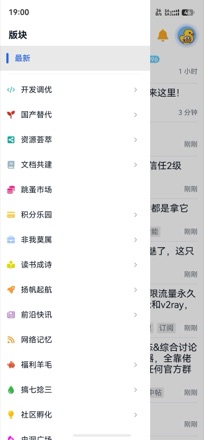
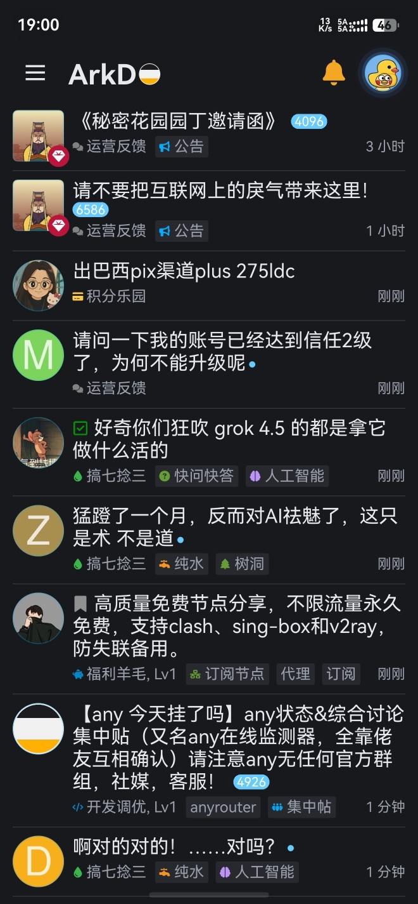
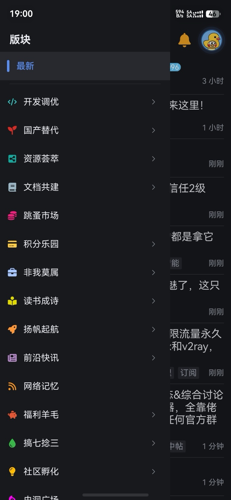
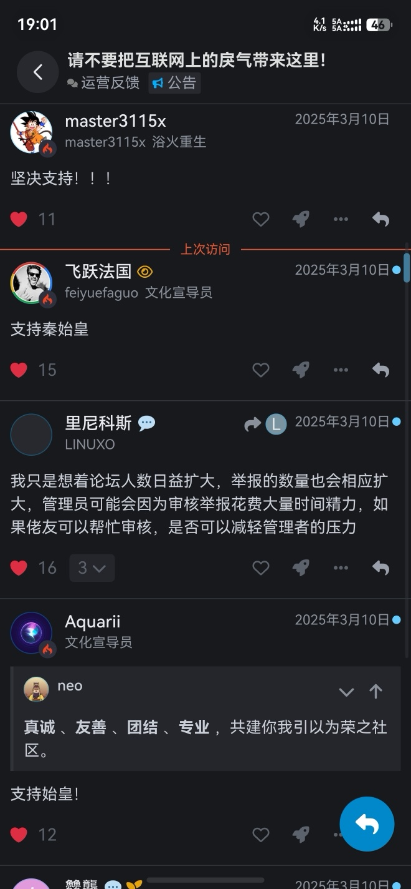
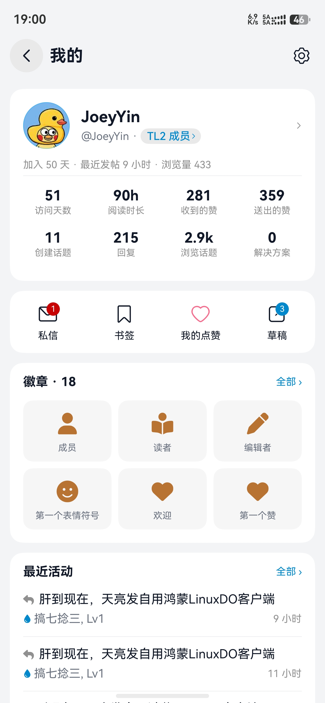
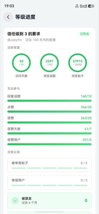
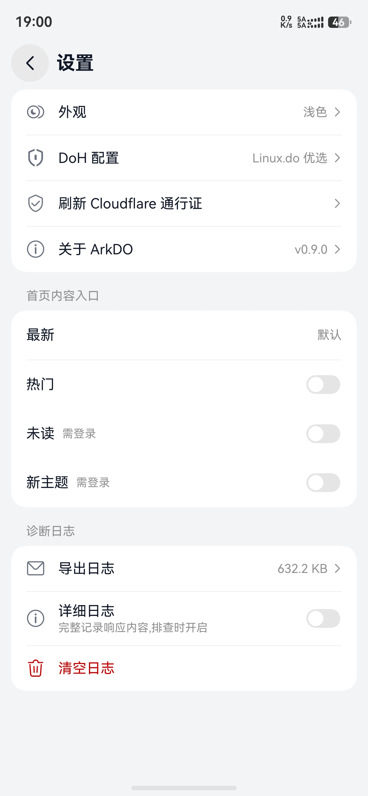
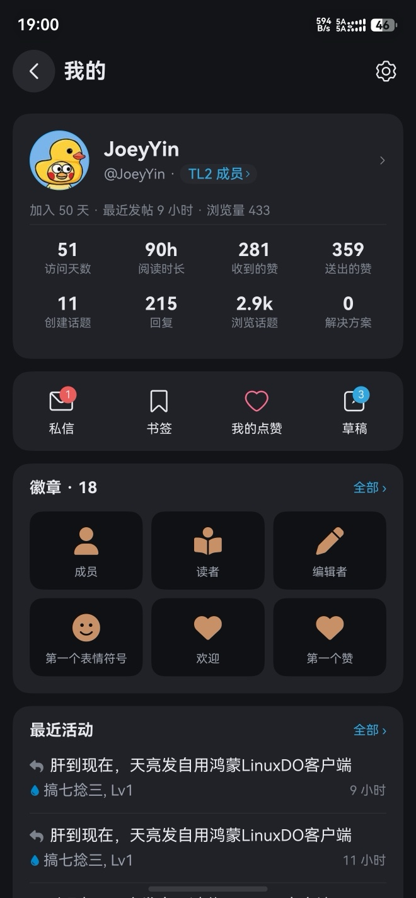
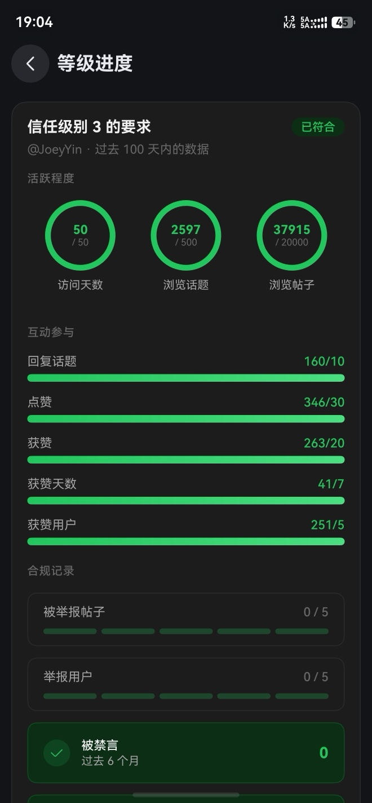
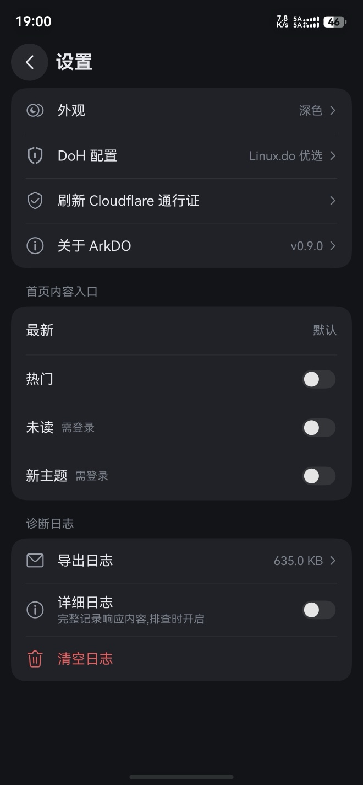

<div align="center">


# ArkDO

**[LINUX DO](https://linux.do) 社区的第三方 HarmonyOS 原生客户端**

用 ArkTS 从零编写，不是网页套壳。

[](https://developer.huawei.com/consumer/cn/)
[](https://developer.huawei.com/consumer/cn/arkts/)
[](https://linux.do)

</div>

---

## 关于 LINUX DO

> **[LINUX DO](https://linux.do) —— 新的理想型社区。**
> Where possible begins. 一个真诚、友善、团结、专业的技术社区。

ArkDO 是 LINUX DO 社区的**非官方**第三方客户端，由社区成员 [@JoeyYin](https://linux.do/u/joeyyin/) 开发，仅为方便鸿蒙用户浏览社区内容，与官方无隶属关系。

社区主站：**https://linux.do**

## 界面

<div align="center">

| 首页 | 版块 | 话题详情 |
| :--: | :--: | :--: |
|  |  |  |
|  |  |  |

| 个人主页 | 等级进度 | 设置 |
| :--: | :--: | :--: |
|  |  |  |
|  |  |  |

</div>

## 这是什么

鸿蒙生态里没有 LINUX DO 的原生客户端，用浏览器刷论坛体验又不够顺手，于是有了 ArkDO。

它把 Discourse 的 JSON 接口直接渲染成原生 ArkUI 界面：帖子列表、话题详情、富文本正文、表情回应、投票、书签、通知、个人主页，都是原生控件绘制的，滚动跟手，支持深色模式和平板双栏。

## 功能

**浏览**
- 最新 / 热门 / 未读 / 新主题多入口，可在设置里勾选启用与排序
- 两级版块树抽屉，按分类看帖
- 话题详情窗口式分页加载，楼层 scrubber 拖动跳楼，按楼号直达
- 引用卡与被引用楼层按需展开、跨帖跳转
- 采纳答案面板、话题摘要卡、按帖子 ID 直跳

**互动**
- 回复评论（输入浮层贴合键盘上沿）
- 表情回应、Boost 助力、投票、"俺也一样"
- 书签增删与置顶，列表 / 详情 / 导航栏三处标记即时联动

**账号**
- ArkWeb 网页登录，会话持久化，未登录写操作自动引导登录
- 个人主页、用户动态（我的话题 / 回复 / 点赞）、徽章墙
- 等级进度（读取 connect.linux.do 的升级要求）
- 通知中心与铃铛角标，覆盖 30+ 种通知类型（含 Boost、Follow）

**阅读体验**
- ArkTS 版 Discourse 阅读进度跟踪，蓝点淡出、"上次访问"红线
- cooked HTML 自研解析器 → 原生 ArkUI 渲染
- LaTeX 数学公式渲染（MathJax 出图）
- 图片预览（双击缩放、下拉关闭）、音视频播放、附件下载
- 站内 Emoji、FontAwesome 徽章图标、标签图标完整还原

**系统推送**（需自建中继，见 [`server/`](server/)）
- App 关闭时也能收到回复 / @ / 私信的系统通知，点击直达对应楼层
- 点推送即标记该条通知已读，铃铛未读数同步递减

**适配**
- 三态深色模式：跟随系统 / 强制浅色 / 强制深色
- 平板横屏双栏、竖屏单栏自适应
- DoH 自定义 DNS（内置优选服务器，支持增删、切换、测速）

## 技术实现

几个值得一提的地方：

### ArkWeb 网络桥
LINUX DO 有 Cloudflare 防护，原生 HTTP 栈发的请求会被拦。ArkDO 的做法是：常驻一个隐藏的宿主 WebView 承载会话，所有接口请求都注入 JS 用浏览器侧的 `fetch` 发出，Cookie（`_t` / `cf_clearance`）由 Chromium 自己管，JSON 回传给 ArkTS 渲染成原生界面。

> 核心文件：`services/network/ArkWebNetworkBridge.ets`

### Cloudflare 挑战的静默恢复
遇到挑战时先在后台重载宿主页，让挑战脚本自己跑通，每 2 秒用 `/latest.json` 探测是否放行；~12 秒还不通才弹出可见页面让用户手动点一下。首页也留了"手动验证"逃生口。

**明确不做的事**：不拦截 Cloudflare 内部端点，不隐藏、不自动绕过人机验证——该让用户看见的验证必须让用户看见。

> 核心文件：`services/challenge/ChallengeRecoveryCoordinator.ets`、`views/pages/CfChallengePage.ets`

### DoH
应对 DNS 污染。通过 `webview.setHttpDns` 把 DoH 下发给 ArkWeb 引擎，内置优选服务器，也可自己加。设置页能测速对比。

> 核心文件：`services/network/DohManager.ets`

### 头像与静态图
原生 `Image` 走系统网络栈会在 TLS 握手阶段被按 SNI 阻断，所以头像也统一经宿主 WebView 取字节再解码成 PixelMap，带并发限流和 LRU 缓存。

> 核心文件：`services/network/AvatarImageCache.ets`

### 数学公式
`discourse-math` 的裸 LaTeX 交给一个 1×1 的离屏 WebView 跑 MathJax 出 SVG，转成 PixelMap 供行内 `ImageSpan` 使用。按需挂载、空闲销毁，没有公式的帖子零开销。

> 核心文件：`services/content/MathRenderService.ets`

### 系统推送
Discourse 的 Web Push 是标准协议（RFC 8291），订阅时的 `endpoint` / `p256dh` / `auth` 全由订阅方提供。把 `endpoint` 填成自建中继、密钥用中继生成的，LINUX DO 就会用**我们的**公钥加密并投递到**我们的**地址；中继解密后转成华为 Push Kit 通知下发。

```
LINUX DO ──Web Push（加密）──▶ 自建中继 ──解密──▶ 华为 Push Kit ──▶ 设备通知
```

中继代码与部署文档在 [`server/`](server/)。**推送不是开箱即用的**：需要自己部署中继、在 AGC 注册应用并申请 Push Kit 权益，然后在 `entry/src/main/resources/rawfile/relay-config.json` 里填中继地址（该文件已被 gitignore，模板见同目录 `relay-config.example.json`）。没有这份配置时推送功能自动降级为不可用，其余功能不受影响。

> 核心文件：`services/push/`、`server/relay.py`

## 项目结构

```
entry/src/main/ets/
├── common/          常量、主题管理、断点适配
├── models/          数据模型
├── navigation/      路由定义（单 @Entry + Navigation 路由栈）
├── services/        14 个服务子域
│   ├── network/     ArkWeb 网桥、DoH、头像缓存
│   ├── challenge/   Cloudflare 挑战检测与恢复
│   ├── content/     cooked HTML 解析、公式、下载、链接路由
│   ├── topic/       话题分页、回应、投票
│   ├── session/     登录态与写操作拦截
│   ├── push/        系统推送：Push Kit token、中继订阅、通知深链
│   └── ...          auth / bookmark / connect / draft / logging / notification / reading / site / user / web
└── views/
    ├── pages/       15 个页面
    └── components/  40 个组件

server/              推送中继（Python，部署在自己的服务器上）
├── relay.py         Web Push 解密 → 华为 Push Kit 转发
└── README.md        部署文档
```

约 2.6 万行 ArkTS，唯一的第三方运行时依赖是 `@rv/image-preview`。

## 构建

**环境要求**
- DevEco Studio（HarmonyOS SDK API 20+）
- 设备：HarmonyOS 6.0.0 及以上，手机 / 平板

**步骤**
1. 克隆仓库后用 DevEco Studio 打开
2. 在 `File → Project Structure → Signing Configs` 配置你自己的签名
3. 连接设备，Run

命令行构建：

```bash
hvigorw assembleHap --mode module -p product=default
```

## 常见问题

**打开一直转圈 / 提示网络异常？**
多半是 DNS 被污染。进「设置 → DoH 设置」开启 DoH 并切换服务器，页面里可以测速。

**卡在人机验证？**
正常情况下 App 会在后台静默过盾。若首页空白超过几秒，会浮现「手动验证」按钮，点进去完成验证即可。也可在「设置 → 刷新 Cloudflare 通行证」主动刷新。

**能发新帖吗？**
目前只支持回复，不支持发新主题、不支持上传图片。私信走内嵌网页。

## 参与贡献

欢迎 Issue 和 PR。已知问题见 `docs/known-issues.md`。

提 Bug 时麻烦附上设备型号、HarmonyOS 版本和复现步骤。

## 免责声明

ArkDO 是个人开发的第三方客户端，与 LINUX DO 官方无关，不代表社区立场。所有内容版权归 LINUX DO 社区及原作者所有。本项目仅供学习交流，请遵守 [LINUX DO](https://linux.do) 社区规则。

## 开源协议

MIT License

---

<div align="center">

Made with ❤️ for **[LINUX DO](https://linux.do)**

</div>
